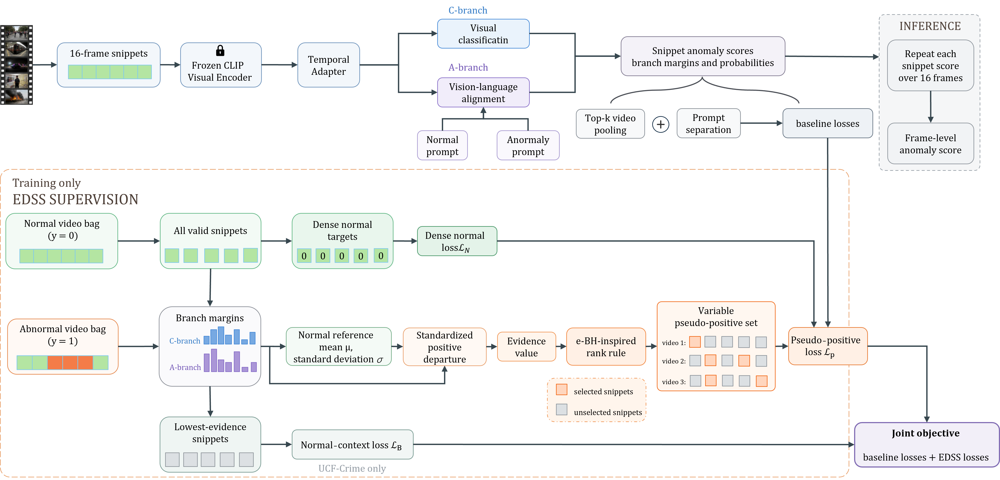

# EDSS

**Evidence-Guided Dense Snippet Supervision for Weakly Supervised Video
Anomaly Detection**

This repository contains the EDSS training objective and its integration with
the VadCLIP video anomaly detector. EDSS adds dense supervision for valid
snippets from known-normal videos and evidence-guided pseudo-positive
supervision for abnormal videos, while retaining the detector's original
top-$k$ multiple-instance learning (MIL) objective.

EDSS is a training-time method. At inference time, the released evaluation
paths use the detector's ordinary snippet scores and expand each score over
its 16-frame span; no selector or e-BH step is run.



## Repository contents

```text
src/          model, training, evaluation, and shared utilities
list/         public split metadata and evaluation ground truth
configs/      the two paper-reproduction launchers
tests/        deterministic regression tests for the public implementation
docs/         method, evidence, limitations, and reproducibility notes
paper/        anonymous manuscript, bibliography, and public figures
```

The repository intentionally does not contain raw videos, downloaded feature
arrays, machine-specific CSV manifests, checkpoints, logs, experiment
artifacts, private writing notes, local tool settings, or historical session
transcripts. These files are either large, machine-dependent, or unnecessary
for a clean source release.

## Setup

Use a Python environment with a CUDA/CPU-compatible PyTorch installation, then
install the remaining dependencies:

```bash
python -m pip install -r requirements.txt
```

The CLIP tokenizer vocabulary is included in `src/clip/`. The video datasets
and CLIP snippet features must be obtained from their respective sources and
remain outside this repository.

## Datasets and checkpoints

The dataset package is available from [Quark Drive](https://pan.quark.cn/s/b57edbb83bd4).
Extraction code: `TwtL`.

The pretrained checkpoint package is available from [Quark Drive](https://pan.quark.cn/s/e835d8220645).
Extraction code: `JEbV`.

Please comply with the original dataset, feature, and checkpoint licenses when
downloading or redistributing these materials. The downloaded files should be
kept outside this Git repository.

## Dataset manifests

Training and evaluation load CSV manifests whose first column points to local
`.npy` feature files. Because those paths cannot be portable, the manifests
are ignored by Git. Generate them after downloading the features:

```bash
python list/make_list_ucf.py \
  --feature-root /path/to/UCFClipFeatures \
  --split list/Anomaly_Train.txt \
  --output list/ucf_CLIP_rgb.csv

python list/make_list_ucf.py \
  --feature-root /path/to/UCFClipFeatures \
  --split list/Anomaly_Test.txt \
  --indices 5 \
  --output list/ucf_CLIP_rgbtest.csv

python list/make_list_xd.py \
  --feature-root /path/to/XDClipFeatures \
  --output list/xd_CLIP_rgb.csv

python list/make_list_xd.py \
  --feature-root /path/to/XDTestClipFeatures \
  --output list/xd_CLIP_rgbtest.csv
```

The supplied `.npy` ground-truth arrays and text annotations are small public
evaluation metadata. See [`list/README.md`](list/README.md) for the mapping.

## Train and evaluate

Run commands from the repository root. The paper recipes are:

```bash
bash configs/edss_ucf.sh
bash configs/edss_xd.sh
```

They accept additional command-line options, for example a different manifest
or output location:

```bash
bash configs/edss_ucf.sh --train-list /data/ucf_train.csv
python src/ucf_test.py --model-path model/best_ucf.pth
```

The direct entry points are also available:

```bash
python -m pytest tests -q
python src/ucf_train.py --tag dev_ucf
python src/xd_train.py --tag dev_xd
python src/ucf_test.py
python src/xd_test.py
```

Training outputs are written under `logs/`, `model/`, or a caller-supplied
output directory; these locations are ignored by Git. The training code never
stages files or creates Git commits.

## Method and evidence

- [`docs/METHOD.md`](docs/METHOD.md) gives the objective and selector details.
- [`docs/RESULTS.md`](docs/RESULTS.md) separates measured results from
  published reference values and unsupported claims.
- [`docs/LIMITATIONS.md`](docs/LIMITATIONS.md) records calibration, protocol,
  and causal-comparison limitations.
- [`docs/REPRODUCIBILITY.md`](docs/REPRODUCIBILITY.md) lists the public
  release boundary and the steps needed to reproduce a run.

## Paper

The anonymous manuscript is in [`paper/main.tex`](paper/main.tex). Build it
from the `paper/` directory with a TeX installation that provides the
`elsarticle` class:

```bash
cd paper
latexmk -pdf main.tex
```

## Attribution

EDSS builds on *VadCLIP: Adapting Vision-Language Models for Weakly
Supervised Video Anomaly Detection* (AAAI 2024). Please cite the original
VadCLIP work and the dataset papers when using the base implementation or
released features. The relevant BibTeX entries are provided in
[`paper/references.bib`](paper/references.bib).

## License

The upstream implementation's license and citation requirements apply to the
adapted components. Review the upstream project and dataset terms before
redistributing weights, features, or derived data.
