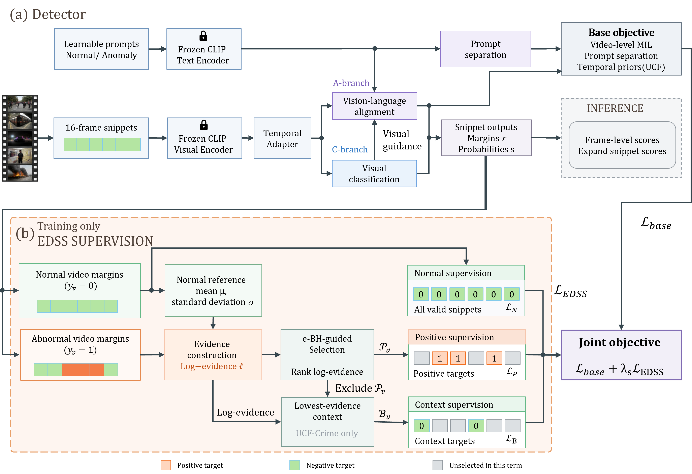

# EDSS

Official PyTorch implementation of **EDSS: Evidence-Guided Dense Snippet
Supervision for Weakly Supervised Video Anomaly Detection**.

## Overview

EDSS is a training-time dense snippet supervision objective for weakly
supervised video anomaly detection. It uses valid snippets from normal videos
as normal targets and selects pseudo-positive snippets in abnormal videos from
their evidence relative to a normal reference. The original VadCLIP top-$k$
multiple-instance learning (MIL) objectives remain active throughout training.

The EDSS selector is used only during training. At inference, the standard
evaluation paths produce ordinary snippet scores and expand each score over its
16-frame span.



The visual classification branch (C) is used for the UCF-Crime benchmark, and
the vision-language alignment branch (A) is used for XD-Violence. The
UCF-Crime recipe also supervises low-evidence context snippets in abnormal
videos. The selector uses an e-BH-inspired rank rule to adaptively select
positive snippets from abnormal videos.

## Repository Layout

```text
EDSS/
|-- configs/                 # Public UCF-Crime and XD-Violence launchers
|-- docs/                    # Method, results, limitations, and reproducibility
|-- list/                    # Split metadata and evaluation ground truth
|-- paper/                   # Manuscript source and figures
|-- src/                     # Model, training, evaluation, and shared utilities
|-- tests/                   # Deterministic regression tests
|-- LICENSE
|-- requirements.txt         # Python dependencies
`-- README.md
```

## Environment

```bash
git clone https://github.com/SVIL2024/EDSS.git
cd EDSS
conda create -n edss python=3.10 -y
conda activate edss
python -m pip install -r requirements.txt
```

For GPU training, install a PyTorch build compatible with the target CUDA
driver by following the [official PyTorch installation guide](https://pytorch.org/get-started/locally/).

## Data Preparation

The project uses pre-extracted CLIP ViT-B/16 snippet features and the supplied
dataset annotations. The shared data package is available from Quark Drive:

| Dataset | Feature backbone | Download | Access code |
|---|---|---|---|
| UCF-Crime | ViT-B/16 CLIP | [Quark Drive](https://pan.quark.cn/s/b57edbb83bd4) | `TwtL` |
| XD-Violence | ViT-B/16 CLIP | [Quark Drive](https://pan.quark.cn/s/b57edbb83bd4) | `TwtL` |

After extraction, use the supplied feature directories or prepare compatible
CLIP snippet features following the upstream VadCLIP procedure. The expected
layout is:

```text
/path/to/features/
|-- UCFClipFeatures/         # class subdirectories containing .npy files
|-- XDTrainClipFeatures/     # training .npy files
`-- XDTestClipFeatures/      # test .npy files
```

Generate the local CSV manifests from the repository root:

```bash
python list/make_list_ucf.py \
  --feature-root /path/to/features/UCFClipFeatures \
  --split list/Anomaly_Train.txt \
  --output list/ucf_CLIP_rgb.csv

python list/make_list_ucf.py \
  --feature-root /path/to/features/UCFClipFeatures \
  --split list/Anomaly_Test.txt \
  --indices 5 \
  --output list/ucf_CLIP_rgbtest.csv

python list/make_list_xd.py \
  --feature-root /path/to/features/XDTrainClipFeatures \
  --output list/xd_CLIP_rgb.csv

python list/make_list_xd.py \
  --feature-root /path/to/features/XDTestClipFeatures \
  --output list/xd_CLIP_rgbtest.csv
```

The generated CSV files contain local feature paths and are intentionally
ignored by Git. Split files and evaluation annotations are provided in `list/`;
see [`list/README.md`](list/README.md) for the file mapping.

## Pre-trained Models

| Dataset | Download | Access code |
|---|---|---|
| UCF-Crime and XD-Violence | [Quark Drive](https://pan.quark.cn/s/e835d8220645) | `JEbV` |

Place the downloaded checkpoints anywhere convenient and pass the local path
through `--model-path`. Do not commit downloaded checkpoints to this repository.

## Training

After preparing the feature manifests, run the corresponding launcher:

```bash
bash configs/edss_ucf.sh
bash configs/edss_xd.sh
```

The launchers use the paper seed and save local checkpoints under `model/` and
logs under `logs/`. Additional options are available through the training
scripts when needed.

## Evaluation

```bash
python src/ucf_test.py --model-path /path/to/best_ucf.pth
python src/xd_test.py --model-path /path/to/best_xd.pth
```

The test scripts expand snippet predictions to frame-level scores and report
AUC/AP together with the dataset-specific temporal localization metrics. The
UCF-Crime protocol reads the C-branch score, while the XD-Violence protocol
reads the A-branch score.

## Results

The following matched-recipe comparison uses a single seed and selects the
best test metric observed during training:

| Method | UCF-Crime AUC (%) | XD-Violence AP (%) |
|---|---:|---:|
| Baseline | 88.00 | 85.50 |
| **EDSS** | **89.00** | **85.76** |
| Gain (percentage points) | +1.00 | +0.27 |

The Baseline uses the same detector, features, and training protocol without
EDSS; EDSS adds dense snippet supervision. Gains are computed from unrounded
metrics. Published VadCLIP results provide an additional reference point:
88.02% AUC on UCF-Crime and 84.51% AP on XD-Violence. See
[`docs/RESULTS.md`](docs/RESULTS.md) for additional experiment details.

## Reproducibility Notes

- The reported recipes use seed `234` and test-best checkpoint selection.
- Each feature snippet represents 16 consecutive frames.
- EDSS is applied during training; inference uses the ordinary VadCLIP score
  paths.
- Downloaded datasets, feature arrays, checkpoints, logs, and generated CSV
  manifests are prepared locally and are not part of this repository.
- Run the regression suite from the repository root with:

  ```bash
  python -m pytest tests -q
  ```

## Acknowledgements

This project builds on:

- [VadCLIP](https://github.com/nwpu-zxr/VadCLIP): Adapting Vision-Language
  Models for Weakly Supervised Video Anomaly Detection.
- [OpenAI CLIP](https://github.com/openai/CLIP).
- The UCF-Crime and XD-Violence benchmark and annotation releases.

Please follow the original citation and license requirements when using the
adapted implementation, datasets, features, or checkpoints.

## Citation

If you use this repository or the EDSS results, please cite the manuscript and
the repository:

```bibtex
@misc{edss2026,
  author       = {{SVIL2024}},
  title        = {{EDSS}: Evidence-Guided Dense Snippet Supervision for Weakly Supervised Video Anomaly Detection},
  year         = {2026},
  howpublished = {GitHub repository},
  url          = {https://github.com/SVIL2024/EDSS}
}
```

The underlying VadCLIP model is described in:

```bibtex
@inproceedings{vadclip2024,
  author    = {Peng Wu and Xuerong Zhou and Guansong Pang and Lingru Zhou and Qingsen Yan and Peng Wang and Yanning Zhang},
  title     = {{VadCLIP}: Adapting Vision-Language Models for Weakly Supervised Video Anomaly Detection},
  booktitle = {Proceedings of the AAAI Conference on Artificial Intelligence},
  volume    = {38},
  pages     = {6074--6082},
  year      = {2024},
  doi       = {10.1609/aaai.v38i6.28423}
}
```

The code is released under the [Apache License 2.0](LICENSE). Please also
follow the original licenses and citation requirements for the datasets and
features.
