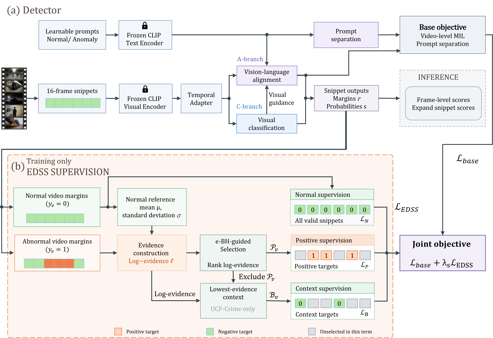

# EDSS

Official PyTorch implementation of **EDSS: Evidence-Guided Dense Snippet
Supervision for Weakly Supervised Video Anomaly Detection**.

EDSS learns to locate anomalous events using video-level labels. It builds on
[VadCLIP](https://github.com/nwpu-zxr/VadCLIP), using a normal-video reference
and an adapted e-value Benjamini–Hochberg (e-BH) rank criterion to construct
training targets for individual snippets.

## Method

1. Build a reference from the detector's responses on normal videos.
2. Express abnormal-video responses as evidence relative to that reference
   and select positive snippets with the e-BH rank criterion.
3. Learn the selected positive targets and normal-video negative targets
   alongside the video-level multiple-instance learning (MIL) objective.



EDSS supervises the visual classification branch (C) on UCF-Crime and the
vision-language alignment branch (A) on XD-Violence. UCF-Crime also uses
negative targets on low-evidence context within abnormal videos. The reference
and targets are updated during training; inference produces snippet scores
and expands each score over its 16 frames.

## Results

Frame-level benchmark results reported in the paper:

| Method | UCF-Crime AUC (%) | XD-Violence AP (%) |
| --- | ---: | ---: |
| Baseline | 88.02 | 84.51 |
| **EDSS** | **89.82** | **85.36** |
| Δ (percentage points) | +1.80 | +0.85 |

AUC denotes area under the receiver operating characteristic curve; AP
denotes average precision. Δ is EDSS minus Baseline.

## Installation

```bash
git clone https://github.com/SVIL2024/EDSS.git
cd EDSS
conda create -n edss python=3.10 -y
conda activate edss
python -m pip install -r requirements.txt
```

For GPU training, use a PyTorch build compatible with your CUDA driver; see
the [PyTorch installation guide](https://pytorch.org/get-started/locally/).
Run the following commands from the repository root.

## Data and models

The detector uses pre-extracted CLIP ViT-B/16 features, with one feature per
16-frame snippet.

| Resource | Download | Access code |
| --- | --- | --- |
| UCF-Crime and XD-Violence CLIP features | [Quark Drive](https://pan.quark.cn/s/b57edbb83bd4) | `TwtL` |
| EDSS checkpoints for both datasets | [Quark Drive](https://pan.quark.cn/s/d9aee3c8f87c) | `p2SM` |

Extract the features into directories with this structure:

```text
/path/to/features/
├── UCFClipFeatures/        # Class subdirectories containing .npy files
├── XDTrainClipFeatures/    # Training .npy files
└── XDTestClipFeatures/     # Test .npy files
```

The data loaders read CSV files with columns `path,label`. Generate them with
the commands below, replacing `/path/to/features` with your feature directory.

**UCF-Crime**

```bash
python list/make_list_ucf.py \
  --feature-root /path/to/features/UCFClipFeatures \
  --split list/Anomaly_Train.txt \
  --output list/ucf_CLIP_rgb.csv

python list/make_list_ucf.py \
  --feature-root /path/to/features/UCFClipFeatures \
  --split list/Anomaly_Test.txt \
  --indices 5 \
  --output list/ucf_CLIP_rgbtest.csv
```

`--indices 5` selects test features ending in `__5.npy`.

**XD-Violence**

```bash
python list/make_list_xd.py \
  --feature-root /path/to/features/XDTrainClipFeatures \
  --output list/xd_CLIP_rgb.csv

python list/make_list_xd.py \
  --feature-root /path/to/features/XDTestClipFeatures \
  --indices 0 \
  --output list/xd_CLIP_rgbtest.csv
```

`--indices 0` selects test features ending in `__0.npy`.

The generators use the video order expected by the supplied frame labels.
Dataset splits and evaluation annotations are provided in `list/`; see the
[dataset metadata guide](list/README.md).

## Training

After preparing the feature lists, run the launcher for the desired dataset:

```bash
# UCF-Crime
bash configs/edss_ucf.sh

# XD-Violence
bash configs/edss_xd.sh
```

Both recipes use seed `234` and ten epochs. UCF-Crime evaluates every ten
optimization steps; XD-Violence evaluates every fifty steps and at each
epoch's end. The run-best checkpoints are saved to `model/runbest_ucf.pth`
and `model/runbest_xd.pth`, with training logs in `logs/`.

The launchers accept additional options, for example:

```bash
bash configs/edss_ucf.sh --train-list /path/to/ucf_train.csv
```

Available arguments are listed by `python src/ucf_train.py --help` and
`python src/xd_train.py --help`.

## Evaluation

Prepare the corresponding test feature list and pass the downloaded
checkpoint's path to `--model-path`:

```bash
# UCF-Crime
python src/ucf_test.py --model-path /path/to/best_ucf.pth

# XD-Violence
python src/xd_test.py --model-path /path/to/best_xd.pth
```

For a model trained locally, use `model/runbest_ucf.pth` or
`model/runbest_xd.pth`. The primary benchmark scores are `AUC1` for UCF-Crime
and `AP2` for XD-Violence. The test scripts also report both branches' AUC/AP
and temporal localization metrics.

## Citation

```bibtex
@misc{edss2026,
  author       = {{SVIL2024}},
  title        = {{EDSS}: Evidence-Guided Dense Snippet Supervision for Weakly Supervised Video Anomaly Detection},
  year         = {2026},
  howpublished = {GitHub repository},
  url          = {https://github.com/SVIL2024/EDSS}
}
```

The underlying VadCLIP model is described in:

```bibtex
@inproceedings{vadclip2024,
  author    = {Peng Wu and Xuerong Zhou and Guansong Pang and Lingru Zhou and Qingsen Yan and Peng Wang and Yanning Zhang},
  title     = {{VadCLIP}: Adapting Vision-Language Models for Weakly Supervised Video Anomaly Detection},
  booktitle = {Proceedings of the AAAI Conference on Artificial Intelligence},
  volume    = {38},
  pages     = {6074--6082},
  year      = {2024},
  doi       = {10.1609/aaai.v38i6.28423}
}
```

## Acknowledgements and license

This project builds on [VadCLIP](https://github.com/nwpu-zxr/VadCLIP) and
[OpenAI CLIP](https://github.com/openai/CLIP). We thank their authors and the
UCF-Crime and XD-Violence dataset contributors.

The code is released under the [Apache License 2.0](LICENSE). Please follow
the original licenses and citation requirements for the datasets and features.
